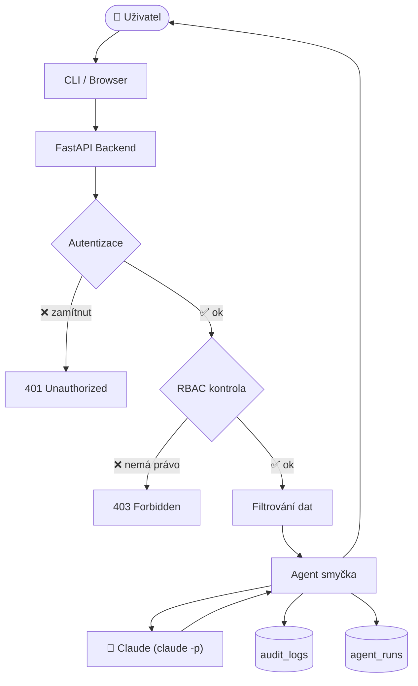
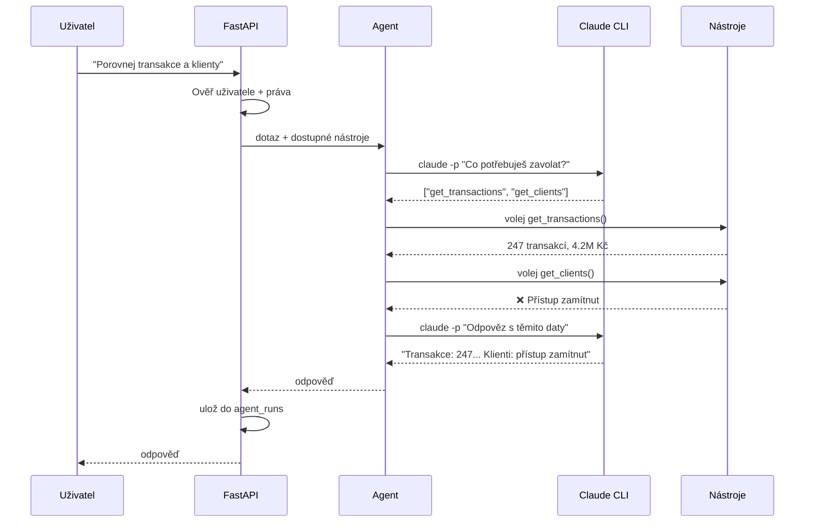
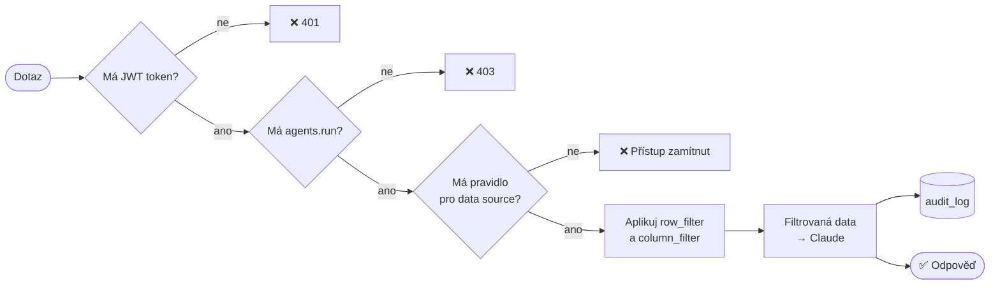
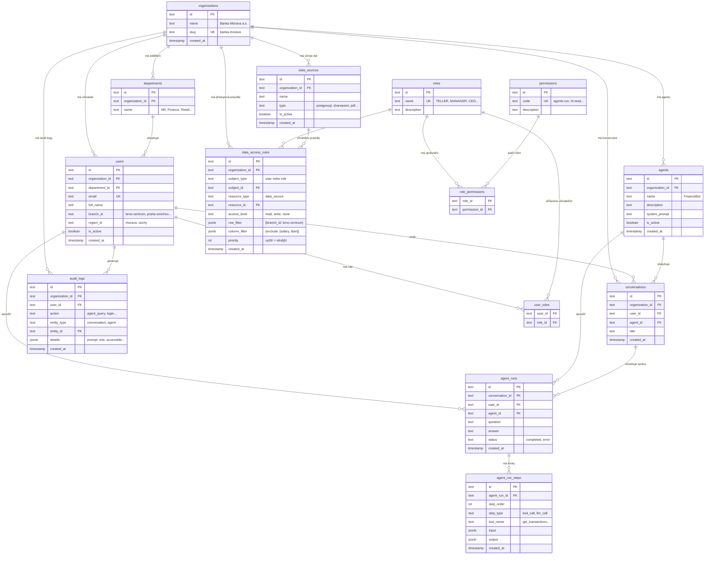
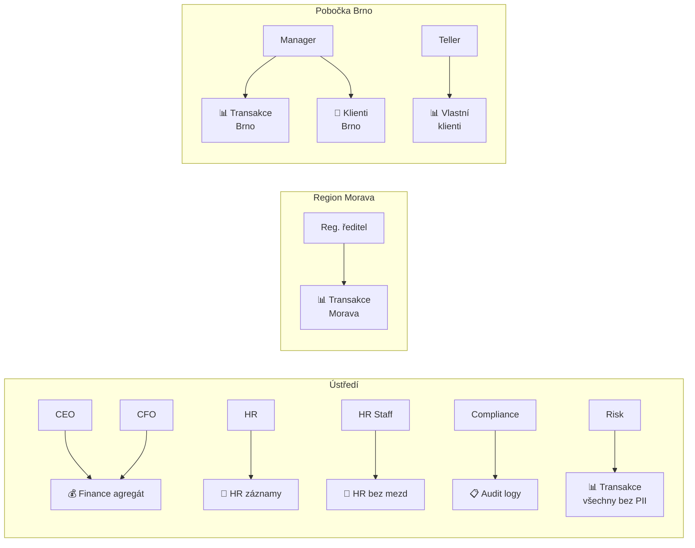

# Grafická schémata – Private AI Agent Platform

---

## 1. Celková architektura

---

## 2. Agent smyčka

---

## 3. Přístupová kontrola

---

## 4. Databázové schéma – podrobné

---

## 5. Kdo co vidí

---

## 6. Soubory projektu

