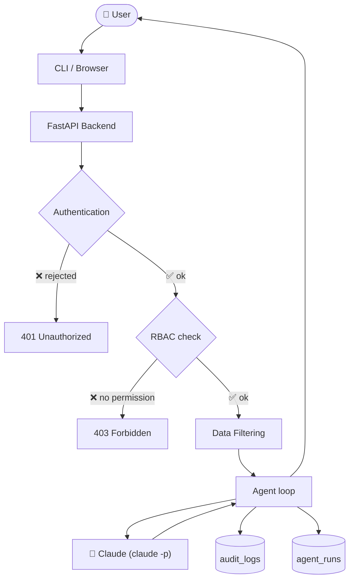
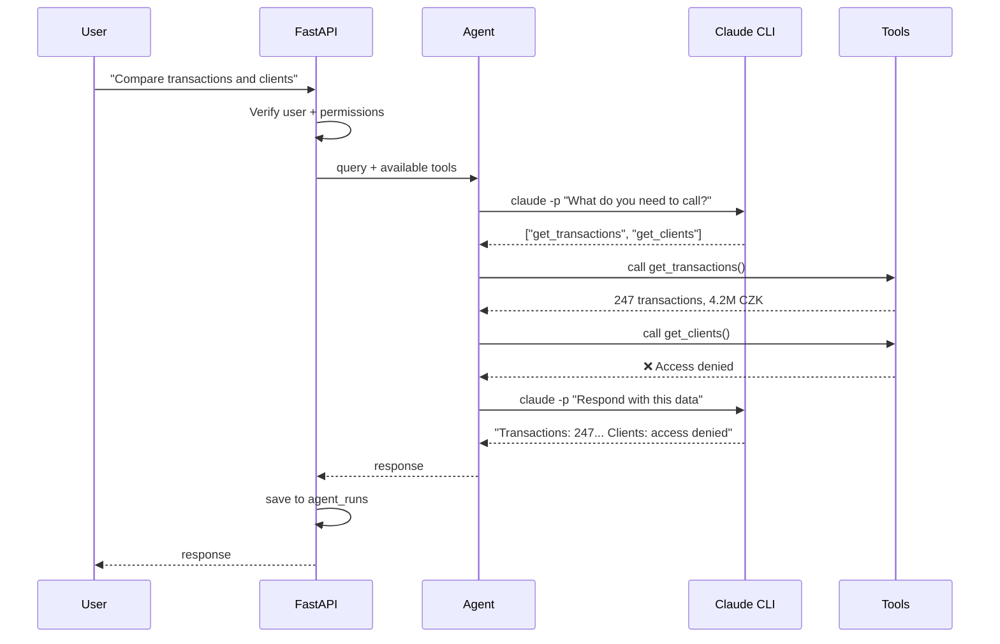
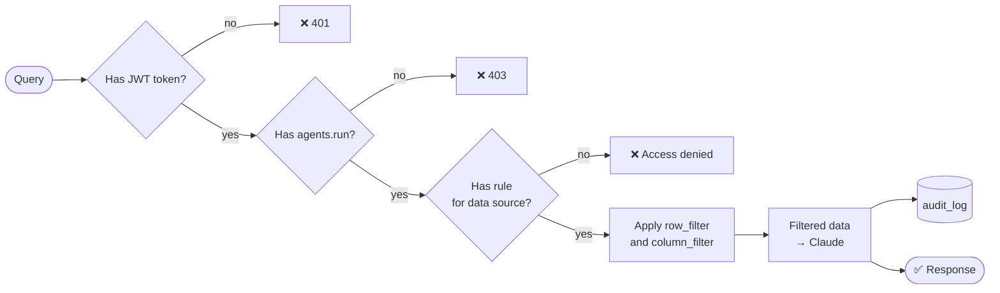
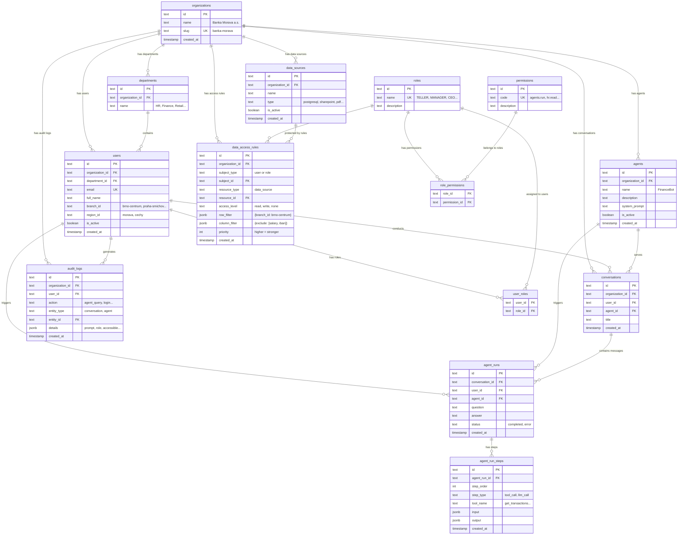
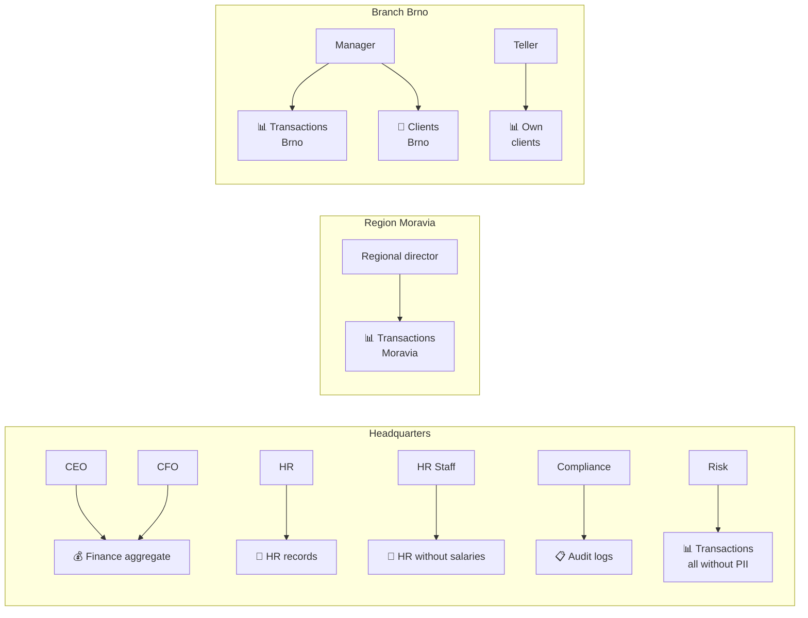
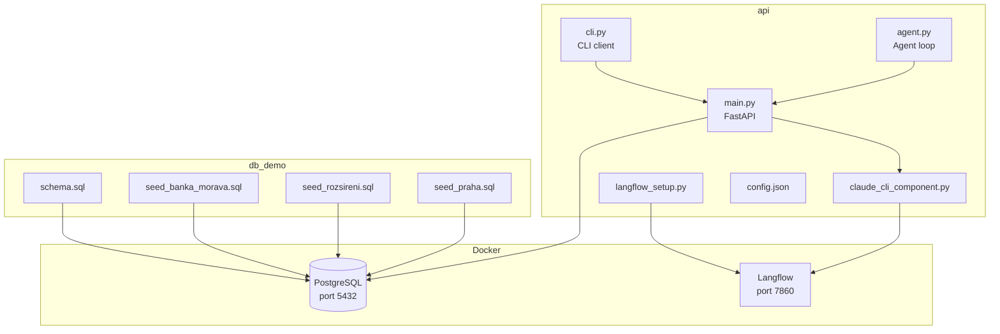

# Visual Diagrams – Private AI Agent Platform

---

## 1. Overall Architecture

---

## 2. Agent Loop

---

## 3. Access Control

---

## 4. Database Schema – Detailed

---

## 5. Who Sees What

---

## 6. Project Files

